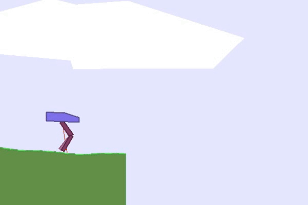
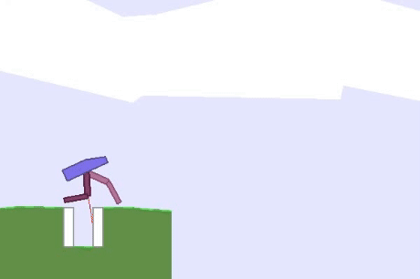

# Bipedal-Walker
The challenge for this coursework was to build an agent to efficiently learn to walk in Gym's BipedalWalker environment, for both the normal and hardcore versions. The terrain in the normal environment is flat, whereas the hardcore environment contains many obstacles that the agent must navigate. 

I trained my agents using Loss Adjusted Approximate Actor Prioritsed Experience Replay (LA3P) and Soft Actor Critic (SAC) [1], for both environments producing agents which learnt very quickly to walk. Convergence for the normal environment, was "outstanding", and my agent achieved "top-of-class" results in the hardcore version. My report details in further information on LA3P, SAC, and how they were applied differently to each environment. Overall I received 86/100 for this coursework.

## Normal (Episode 1,400)

## Hardcore (Episode 1,300)

[1] Baturay Saglam et al. “Actor prioritized experience replay”. In: Journal of Artificial Intelligence Research 78 (2023), pp. 639–672.

